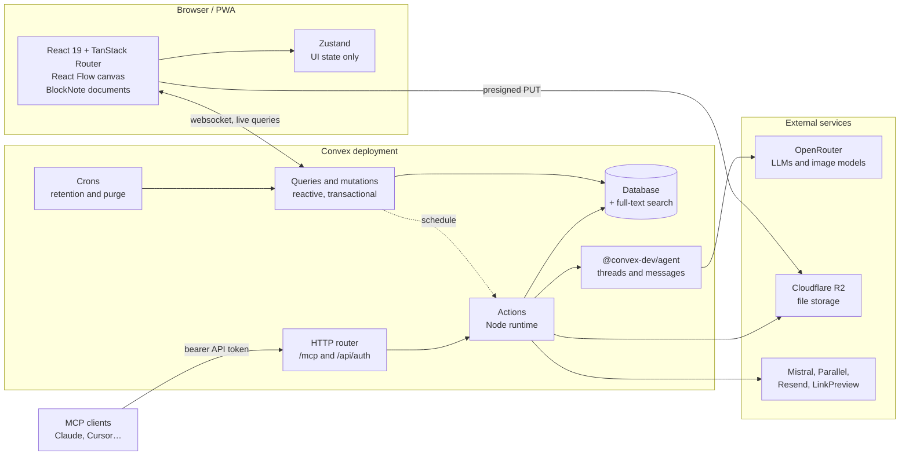

<div align="center">


# Nolënor

**Your thinking deserves a canvas.**

An infinite canvas of typed nodes, with an AI agent that edits them next to you —
instead of a chat window that writes essays at you.

[](https://github.com/antaymard/nolenor/actions/workflows/ci.yml)
[](LICENSE)
[](https://convex.dev)
[](https://react.dev)
[](https://www.typescriptlang.org/)

</div>

<!-- Drop a real screenshot of a canvas here once you have one you're happy with:
      -->

---

## What it is

Most AI tools give you a chat log. You ask, they answer in prose, and you copy the
useful bits somewhere else by hand.

Nolënor puts the work on a canvas instead. Everything is a **node**: a rich-text
document, an image, a table, a PDF, a link, a single value, a node type you defined
yourself. Nodes sit on an infinite plane and can be connected by edges.

**Nolë**, the built-in agent, operates on that same canvas through tools, not through
text. It creates a node, updates a value, connects two blocks, rewrites a paragraph of
a document. Because the backend is reactive, it can work on one node while you're
editing another — nothing blocks, nothing needs refreshing.

## Features

- **Infinite canvas** — pan, zoom, drag, connect. Node types: rich-text document
  (BlockNote), image, video, audio, PDF, link, table, embed, title, single value,
  interactive app, and `custom` nodes whose shape you define yourself.
- **Custom node templates** — build a node type from typed fields, with a compact
  layout for the canvas and an expanded one for the detail window. Reusable across
  all your canvases.
- **App nodes** — Nolë writes a React component, it runs in a sandboxed iframe, and it
  reads live data from the nodes wired into it through a small SDK. Dashboards, charts
  and calculators sitting on the canvas next to the data they read.
- **Nolë, the agent** — streams into the canvas via `@convex-dev/agent`, with tools
  for reading and writing nodes, editing documents block by block, web search, page
  reading, and image generation. Sub-agents run their own threads.
- **Node automations** — a node can be told to refresh itself, either through an
  agent or as a plain data-processing step.
- **Skills and recipes** — skills are named capability packs (a description, its
  instructions, and file attachments), either shipped with the app under
  `convex/systemSkills/` or written by the user. Recipes are reusable instructions for
  tasks you want Nolë to run the same way every time.
- **Full-text search** — across node contents, including OCR'd PDFs, chunked and
  indexed as content changes.
- **Sharing** — per-canvas `viewer` / `editor` / `owner` permissions, enforced
  server-side on every function.
- **Version history** — invisible pre-write snapshots of node values, purged by cron
  after their retention window. They survive node deletion, so they double as a trash.
- **MCP server** — your canvases are exposed over the Model Context Protocol at
  `/mcp`, authenticated with scoped API tokens. Point Claude, Cursor, or any MCP
  client at them.
- **AI cost tracking** — append-only usage ledger plus a daily rollup, with per-message
  model, tokens, and cost.
- **Voice** — dictation via Voxtral, or full realtime voice through an external voice
  server.
- **Installable PWA** — offline shell, update prompt, works on tablets.
- **Data export** — take your canvases with you.

## Stack

| Layer | Choice |
| --- | --- |
| Frontend | React 19, TypeScript, Vite, TanStack Router (file-based), Tailwind 4, shadcn/ui |
| Canvas | React Flow (`@xyflow/react`) |
| Editor | BlockNote |
| UI state | Zustand (UI only — server state stays in Convex) |
| Backend | [Convex](https://convex.dev) — database, functions, reactivity, auth, crons, HTTP |
| AI | `@convex-dev/agent` + Vercel AI SDK, all models routed through OpenRouter |
| Files | Cloudflare R2 (presigned uploads, reference-counted objects) |
| Auth | [Convex Auth](https://labs.convex.dev/auth) — email + password with OTP verification, Google OAuth |
| Analytics | PostHog (optional) |
| Package manager | Yarn 1 |

### How the pieces fit



## Getting started

### Prerequisites

- Node.js 22+ and Yarn 1
- A Convex deployment — cloud or self-hosted, see below
- An [OpenRouter](https://openrouter.ai) key if you want the AI to do anything
- A [Cloudflare R2](https://developers.cloudflare.com/r2/) bucket if you want file uploads
- A [Resend](https://resend.com) key if you want anyone to be able to sign up

### 1. Install

```bash
git clone https://github.com/antaymard/nolenor.git
cd nolenor
yarn install
```

### 2. Pick a backend

Nolënor needs Convex. That's not a soft dependency you can swap for Postgres in an
afternoon: the reactivity, the transactional guarantees, the search indexes, the
agent component, and the auth flow are all Convex. But it isn't a lock-in either:
Convex's own backend is source-available and self-hostable, so you have two paths.

<details open>
<summary><b>Option A — Convex Cloud</b> (fastest, generous free tier)</summary>

```bash
npx convex dev
```

It walks you through login and project creation, then writes `VITE_CONVEX_URL` into
`.env.local` and keeps watching `convex/` for changes. Leave it running.

</details>

<details>
<summary><b>Option B — Self-hosted Convex</b> (your own machine, your own data)</summary>

The Convex backend is source-available under
[FSL-1.1-Apache-2.0](https://github.com/get-convex/convex-backend/blob/main/LICENSE.md)
(it converts to Apache 2.0 two years after each release). Self-hosting your own app on
it is exactly what the license allows.

```bash
# from https://github.com/get-convex/convex-backend/tree/main/self-hosted
curl -O https://raw.githubusercontent.com/get-convex/convex-backend/main/self-hosted/docker/docker-compose.yml
docker compose up -d

# generate an admin key for the CLI
docker compose exec backend ./generate_admin_key.sh
```

Then, in `.env.local`:

```dotenv
CONVEX_SELF_HOSTED_URL='http://127.0.0.1:3210'
CONVEX_SELF_HOSTED_ADMIN_KEY='<the key you just generated>'
VITE_CONVEX_URL='http://127.0.0.1:3210'
```

Defaults: backend on `:3210`, HTTP actions (so `/mcp`, `/api/auth`) on `:3211`,
dashboard on `:6791`. From there `npx convex dev` and `npx convex env set` behave the
same as against the cloud.

Two things worth knowing before you put a self-hosted deployment on a real domain:

- Set `CONVEX_CLOUD_ORIGIN` and `CONVEX_SITE_ORIGIN` on the backend container. They
  default to `http://127.0.0.1:3210` / `:3211`, and `convex/auth.config.ts` uses the
  second one (as `CONVEX_SITE_URL`) as the issuer of its own JWTs. Leave them on the
  loopback defaults behind a public domain and every session token gets rejected.
- Actions run in Convex's Node runtime here too, but the `node` block of
  `convex.json` marks a few packages as external (`sharp`, `jsdom`,
  `@blocknote/core`). If an action fails to bundle, that list is the first place to
  look.

</details>

### 3. Generate auth keys

Convex Auth signs its own session JWTs, so the deployment needs a key pair:

```bash
node generateKeys.mjs
```

It prints `JWT_PRIVATE_KEY` and `JWKS`. Set both on the deployment (next step) — not
in `.env.local`, they're server-side secrets.

### 4. Configure the deployment

Every backend variable is set on the Convex deployment, never in a file:

```bash
# --- required ---
npx convex env set SITE_URL            http://localhost:5173
npx convex env set JWT_PRIVATE_KEY     "<from generateKeys.mjs>"
npx convex env set JWKS                '<from generateKeys.mjs>'
npx convex env set AUTH_RESEND_KEY     re_...
npx convex env set OPENROUTER_API_KEY  sk-or-...

# --- required for any file upload (image, pdf, audio, video nodes) ---
npx convex env set R2_ACCOUNT_ID        ...
npx convex env set R2_ACCESS_KEY_ID     ...
npx convex env set R2_SECRET_ACCESS_KEY ...
npx convex env set R2_BUCKET_NAME       nolenor-files
npx convex env set R2_PUBLIC_URL        https://files.example.com

# --- optional, each one lights up one feature ---
npx convex env set AUTH_EMAIL_FROM      "Nolënor <hello@example.com>"
npx convex env set AUTH_GOOGLE_ID       ...
npx convex env set AUTH_GOOGLE_SECRET   ...
npx convex env set MISTRAL_API_KEY      ...
npx convex env set PARALLEL_API_KEY     ...
npx convex env set LINK_PREVIEW_APIKEY  ...
npx convex env set VOICE_SERVER_URL     https://voice.example.com
npx convex env set VOICE_SERVER_TOKEN   ...

# --- optional, and necessarily later: you need the app running to build the
#     canvases first, then paste their ids (from their /canvas/<id> URL).
#     Every new account gets a copy of each, first one landed on. ---
npx convex env set STARTER_CANVAS_IDS   jd7abc...,jh2def...
```

### 5. Run it

```bash
npx convex dev   # terminal 1 — pushes functions, watches convex/
yarn dev         # terminal 2 — Vite on http://localhost:5173
```

`yarn dev` regenerates the system-skills registry first (`predev`), so
`convex/systemSkills/_registry.generated.ts` stays in sync with the `SKILL.md` files.

## Environment variables

### On the Convex deployment

Set with `npx convex env set NAME value`, or through the Convex dashboard.

| Variable | Required | What it does | Where it comes from |
| --- | :---: | --- | --- |
| `SITE_URL` | ✅ | Origin of the frontend. Used for OAuth returns and email links. `convex/auth.ts` throws a helpful error if it's missing. | `http://localhost:5173` in dev, your domain in prod |
| `JWT_PRIVATE_KEY` | ✅ | Signs Convex Auth sessions | `node generateKeys.mjs` |
| `JWKS` | ✅ | Public half of the same key pair | `node generateKeys.mjs` |
| `AUTH_RESEND_KEY` | ✅ | Sends the email OTP that verifies a new account, and password-reset codes. Sign-up does not work without it. | [resend.com](https://resend.com) |
| `OPENROUTER_API_KEY` | ✅ | Every LLM call and every image generation | [openrouter.ai](https://openrouter.ai) |
| `R2_ACCOUNT_ID` | ⚠️ | Cloudflare account id, used to build the S3 endpoint | Cloudflare dashboard |
| `R2_ACCESS_KEY_ID` | ⚠️ | R2 API token | Cloudflare → R2 → API tokens |
| `R2_SECRET_ACCESS_KEY` | ⚠️ | R2 API secret | idem |
| `R2_BUCKET_NAME` | ⚠️ | Bucket holding uploads | your bucket |
| `R2_PUBLIC_URL` | ⚠️ | Public base URL objects are served from | custom domain on the bucket |
| `AUTH_EMAIL_FROM` | — | `From:` of auth emails. Defaults to `Nolenor <onboarding@resend.dev>`, which only delivers to your own Resend account address. | a verified Resend domain |
| `AUTH_GOOGLE_ID` | — | Enables "Sign in with Google". Email + password works without it. | Google Cloud console |
| `AUTH_GOOGLE_SECRET` | — | idem | idem |
| `MISTRAL_API_KEY` | — | Voice dictation (Voxtral) and PDF OCR feeding the search index. Without it, both fail loudly when used. | [mistral.ai](https://mistral.ai) |
| `PARALLEL_API_KEY` | — | Nolë's web search and page-reading tools | [parallel.ai](https://parallel.ai) |
| `LINK_PREVIEW_APIKEY` | — | Title, description and image of link nodes | [linkpreview.net](https://www.linkpreview.net) |
| `VOICE_SERVER_URL` | — | Realtime voice. The voice server itself is a separate service, not in this repo. Unset means the feature is simply hidden. | your own deployment |
| `VOICE_SERVER_TOKEN` | — | Shared token for that server. Its origin allowlist is the real security boundary — see the comment in `convex/voice.ts`. | idem |
| `STARTER_CANVAS_IDS` | — | Comma-separated canvas ids cloned into every new account at sign-up — a tutorial, templates, whatever you build. **Order matters**: the first one is stamped as the most recently updated, so it's the one the home page surfaces. Unset, a new account just gets one empty workspace. | ids of canvases you build in the app yourself, read from their `/canvas/<id>` URL |

⚠️ = the app runs without it, but any upload (image, PDF, audio, video, chat
attachment) will fail.

`CONVEX_SITE_URL` is provided by the deployment itself — derived from
`CONVEX_SITE_ORIGIN` when self-hosted — and read by `convex/auth.config.ts` as the
issuer of the app's own JWTs. Don't set it by hand.

### For the frontend and the build (`.env.local`)

Copy `.env.example` to `.env.local` and fill it in. Only `VITE_`-prefixed variables
reach the browser bundle.

| Variable | Required | What it does |
| --- | :---: | --- |
| `VITE_CONVEX_URL` | ✅ | Convex deployment the client connects to. `npx convex dev` writes it for you. |
| `CONVEX_SELF_HOSTED_URL` | — | Self-hosting only: where the CLI pushes functions |
| `CONVEX_SELF_HOSTED_ADMIN_KEY` | — | Self-hosting only: admin key from `generate_admin_key.sh` |
| `VITE_POSTHOG_KEY` | — | PostHog project key. **See the fork note below** — there is a hardcoded fallback. |
| `VITE_POSTHOG_HOST` | — | PostHog ingestion host, same caveat |
| `POSTHOG_API_KEY` | — | Build-time only: uploads source maps so production stack traces are readable. No key, no upload, no error. |
| `POSTHOG_PROJECT_ID` | — | idem |
| `POSTHOG_HOST` | — | idem |

## Before you deploy a fork

The code is open, and it runs anywhere Convex runs. But a few values in it point at
*this* instance of Nolënor. Change them before you put a fork in front of real users:

1. **`src/lib/analytics.ts`** — the PostHog key and host fall back to Nolënor's own
   project when `VITE_POSTHOG_KEY` / `VITE_POSTHOG_HOST` are unset. A production build
   of a fork would ship its telemetry to us. Set your own, or delete the fallback.
   (Analytics are off in dev regardless.)
2. **`convex/auth.ts`** — `ALLOWED_REDIRECT_ORIGINS` hardcodes `app.nolenor.com` and
   `app.nolenor.fr`. Replace them with your own origins. This list is the only guard
   against an open redirect on the OAuth flow, so don't widen it casually. Loopback
   origins are already accepted, but only when the deployment itself is local.
3. **`convex/http.ts`** — `ALLOWED_WISHLIST_HOSTNAMES` restricts the unauthenticated
   `/wishlist/subscribe` endpoint to the nolenor.fr / nolenor.com landing pages. If you
   have no landing page, drop the route.
4. **`convex/ia/agents.ts`** — `chatModelOptions` and `imageModelOptions` are a curated
   list of OpenRouter model ids with their prices, used for the model picker and for
   cost accounting. Model ids and prices move; yours will differ.
5. **Branding** — `index.html`, the PWA manifest in `vite.config.ts`, `public/icons/`,
   and the agent's own name and persona in `convex/ia/systemPrompts/`.

## Scripts

| Command | What it does |
| --- | --- |
| `yarn dev` | Vite dev server (regenerates the skills registry first) |
| `yarn build` | Production build into `dist/` |
| `yarn preview` | Serve the built bundle |
| `yarn lint` | ESLint over the whole repo |
| `yarn typecheck` | `tsc` over `src/` |
| `yarn typecheck:convex` | `tsc` over `convex/` — separate tsconfig, easy to forget |
| `yarn gen:system-skills` | Rebuild `convex/systemSkills/_registry.generated.ts` from the `SKILL.md` files |
| `npx convex dev` | Push and watch backend functions |
| `npx convex deploy` | Push to the production deployment |

CI runs the skills registry generation, both typechecks, and lint on every pull request
and every push to `master`.

## Project structure

```
convex/                    Backend
  schema.ts                Tables, indexes, search indexes
  auth.ts                  Convex Auth providers, OAuth redirect allowlist
  http.ts                  HTTP routes: auth, MCP, wishlist
  crons.ts                 Retention jobs
  <feature>.ts             Public API surface (canvases, nodeDatas, threads, skills…)
  models/                  Business logic as plain functions taking a Convex ctx
  wrappers/                internalQuery/internalMutation around models, so actions
                           and agent tools can reach them across the boundary
  schemas/                 Per-table validators
  config/                  Node types, field types, upload policy, error catalogue
  ia/                      Agents
    agents.ts              Model registry and agent assembly
    nole.ts                Main chat entry point (streaming)
    tools/                 Agent tools: nodes, edges, documents, web, images
    systemPrompts/         Nolë's prompting
  mcp/                     MCP server: registry, auth, execution
  searchable/              Chunking and OCR for the search index
  systemSkills/            Shipped skills as SKILL.md + generated registry
  lib/                     Auth guards, R2, rate limits, text utilities

src/                       Frontend
  routes/                  File-based routes (TanStack Router)
  components/              UI, canvas, node types, Nolë panel
  stores/                  Zustand stores (canvas, nodeData, nole, windows, …)
  hooks/                   Custom hooks
  lib/                     Analytics, error handling, update flow, utilities
  types/                   Shared types

SPECS/                     Design notes for in-flight work
.github/instructions/      Context files for coding agents
```

### Conventions

- **Server state lives in Convex.** Zustand holds UI state only — active tool, open
  windows, focus. Don't mirror documents into a client store; subscribe to a query.
- **Public functions validate and authorize.** `requireAuth()`, `optionalAuth()`,
  `requireCanvasAccess(permission)` and `getCanvasAccess()` live in `convex/lib/auth.ts`,
  and every public function that touches a canvas goes through one of them.
- **Business logic goes in `models/`**, not in the function bodies, so a mutation and an
  agent tool can share it.
- **Comments explain the *why*.** Much of this codebase is commented in French, at
  length, on the reasoning behind a non-obvious choice. Keep that habit; skip the
  comments that just restate the code.
- Components in `PascalCase`, utilities in `camelCase`.
- Prefer the simple solution. React Flow already manages its own internal state — don't
  duplicate it.

## Using the MCP server

Any Convex deployment exposes HTTP actions on its `.convex.site` domain (or port `3211`
self-hosted). Nolënor mounts an MCP server at `/mcp`:

1. Create a token in the app: **Settings → API tokens**, with `read` or `write`
   permission. Tokens are stored as a SHA-256 digest — the plaintext is shown once.
2. Point an MCP client at `https://<your-deployment>.convex.site/mcp`, passing the
   token as a bearer credential:

```json
{
  "mcpServers": {
    "nolenor": {
      "type": "http",
      "url": "https://<your-deployment>.convex.site/mcp",
      "headers": { "Authorization": "Bearer nlnr_..." }
    }
  }
}
```

The tools mirror Nolë's own: `list_canvases`, `list_nodes`, `read_nodes`,
`full_text_search`, then `create_node`, `create_connection`, `set_node_data` and the
block and table tools. Write tools need a `write` token *and* editor access to the
canvas — the MCP surface doesn't bypass the permission model.

## Deploying

**Backend** — `npx convex deploy` for Convex Cloud, or push to your self-hosted
deployment with `CONVEX_SELF_HOSTED_*` set. Remember to set every env var on the
production deployment too; they don't carry over from dev. `SITE_URL` in particular
must be the production frontend origin.

**Frontend** — `yarn build` produces a static `dist/`, deployable to any static host.
This instance runs on Cloudflare Pages, which is why the PWA is configured with
`registerType: "prompt"` rather than `autoUpdate`: Pages only serves the current
deployment's assets, so a service worker that activates on its own would break tabs
whose chunks no longer exist. Keep that in mind if you host it somewhere with the same
behaviour.

Set `VITE_CONVEX_URL` in the host's build environment, and add your production origin
to `ALLOWED_REDIRECT_ORIGINS` in `convex/auth.ts` if you use Google sign-in.

## Contributing

Issues and pull requests are welcome. Before you open one:

```bash
yarn lint && yarn typecheck && yarn typecheck:convex
```

Those three are exactly what CI runs. Convex code has its own tsconfig, so the second
typecheck really does catch things the first one misses.

If you use an AI coding assistant, `.github/instructions/` and `CLAUDE.md` hold the
project context — including the reminder to read `convex/_generated/ai/guidelines.md`
before touching anything under `convex/`.

## License

[GNU AGPL-3.0](LICENSE).

You can run it, modify it, and self-host it. If you run a modified version as a network
service, the AGPL asks you to make your modified source available to its users. Sharing
improvements back is the point.

Convex itself is separately licensed: the backend is source-available under
[FSL-1.1-Apache-2.0](https://github.com/get-convex/convex-backend/blob/main/LICENSE.md),
which permits self-hosting your own application and converts to Apache 2.0 two years
after each release.
